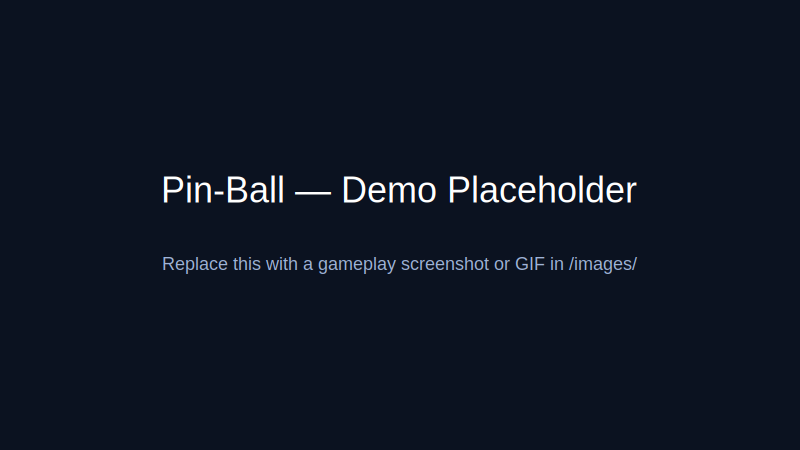

# Pin-Ball

 

TL;DR: A minimal pinball game built with Godot — small, playable, and easy to open in the Godot editor.

## Demo



## Requirements

- Godot Engine 4.5 (project configured for Godot 4.5; see `project.godot`).

## Quick Start — Run locally

1. Install Godot 4.5 from https://godotengine.org if you don't have it.
2. Open the project folder in Godot (File → Open Project) or run from command line:

```bash
godot --path .
```

3. Press F5 or click the Play button to run the game.

The main scene (`scenes/Main.tscn`) will load automatically.

## Controls

- **Flipper Left:** Left Arrow / A
- **Flipper Right:** Right Arrow / D
- **Charge Launcher:** Hold Space / Hold Down Arrow
- **Pause:** Esc

## Gameplay

- Use the flippers to keep the ball in play
- **Down Arrow**: Release ball from queue (falls through maze pipe)
- Hold Space to charge the launcher, then release to launch (if ball arrives at launcher)
- Charge longer for more launch power (visual meter shows charge level)
- Ball queue system: 4 balls available, releases when Down Arrow pressed
- **Maze Pipe System**: Ball falls through tile-based maze channels before reaching playfield
- Score points by hitting obstacles:
  - **Bumpers**: 20 points (large, high bounce)
  - **Pegs**: 5 points (small, medium bounce)
  - **Walls**: 15 points (rectangular, directional bounce)
- Ball stays within playfield boundaries at all times

## Project Structure

```
pin-ball/
├── scenes/
│   ├── Main.tscn          # Main game scene with playfield
│   ├── Ball.tscn          # Ball prefab
│   ├── Flipper.tscn       # Flipper prefab
│   ├── Launcher.tscn     # Visual plunger launcher
│   ├── BallQueue.tscn     # Ball queue display
│   └── Obstacle.tscn      # Obstacle prefab
├── scripts/
│   ├── Ball.gd            # Ball physics and collision handling
│   ├── Flipper.gd         # Flipper input and rotation
│   ├── GameManager.gd     # Game state, scoring, ball spawning
│   ├── UI.gd              # UI and score display
│   ├── Launcher.gd        # Plunger launcher with charge mechanics
│   ├── BallQueue.gd       # Ball queue management
│   ├── Obstacle.gd        # Obstacle collision and scoring
│   ├── ObstacleSpawner.gd # Random obstacle placement (maze-aware)
│   ├── MazePipeManager.gd # TileMap-based maze pipe system
│   ├── Ramp.gd            # Curved ramp system
│   ├── release.sh         # Version release script
│   └── build.sh           # Binary export script
├── assets/tilesets/
│   └── pipe_maze_tileset.tres  # TileSet resource for maze pipes
├── levels/maze_layouts/
│   ├── level_1.json       # Default maze layout
│   └── README.md          # Maze layout format documentation
├── releases/              # Archived versions
│   └── v0.1.1/
│       ├── binaries/      # Exported binaries
│       └── source/        # Archived source code
├── VERSION                # Current version
├── CHANGELOG.md           # Version history
├── VERSIONS.md            # Detailed version documentation
├── export_presets.cfg     # Godot export configuration
├── project.godot          # Project configuration
└── README.md
```

## Implementation Details

### Physics
- Uses Godot's built-in RigidBody2D physics
- Collision layers: Ball (1), Flippers (2), Walls (4), Obstacles (8)
- Physics materials configured for realistic bounce and friction
- Gravity set to 980.0 (standard Earth gravity)
- Enhanced boundary system prevents ball from escaping playfield

### Components
- **Ball**: RigidBody2D with circle collision, boundary detection, queue management
- **Flippers**: Rotating RigidBody2D controlled by keyboard input
- **Walls**: StaticBody2D with physics materials for bounce
- **Launcher**: Visual plunger with charge mechanics (500-1000 force range)
- **Ball Queue**: Queue system with 4 visible standby balls
- **Obstacles**: Random static obstacles (bumpers, pegs, walls) with scoring
- **Maze Pipe System**: TileMapLayer-based maze pipes guiding ball through channels
- **MazePipeManager**: Manages maze tilemap configuration and level layouts
- **ObstacleSpawner**: Maze-aware obstacle placement (avoids maze walls)
- **Game Manager**: Handles ball spawning, scoring, launcher, queue, obstacles, and maze

### Development Workflow

**Using Cursor + Godot IDE:**
1. Edit `.gd` scripts and `.tscn` scene files in Cursor
2. Save files
3. Switch to Godot IDE (auto-reloads changed files)
4. Test and iterate

This workflow works well because:
- Godot's scripts (`.gd`) are plain text files
- Scene files (`.tscn`) are text-based and editable
- Godot IDE provides visual editing, debugging, and testing tools

## Version Control

The project uses semantic versioning (MAJOR.MINOR.PATCH). Current version: **v1.0.0**

### Version Files
- `VERSION`: Current version identifier
- `CHANGELOG.md`: Version history
- `VERSIONS.md`: Detailed feature documentation per version

### Release Process

To create a new release:

```bash
./scripts/release.sh v0.1.2
```

The release script will:
1. Archive current source to `releases/v0.1.2/source/`
2. Create git tag (if in git repository)
3. Update `VERSION` file
4. Export binaries (if export presets configured)
5. Update documentation

See `VERSIONS.md` for detailed feature documentation of each version.

## Export / Build

### Setting Up Export Presets

1. Open project in Godot Editor
2. Go to **Project → Export**
3. Add presets for your target platforms (Linux, macOS, Windows)
4. Save the project (updates `export_presets.cfg`)

### Building Binaries

```bash
./scripts/build.sh v0.1.1
```

Or manually export from Godot Editor:
1. **Project → Export**
2. Select your platform preset
3. Click **Export Project**
4. Save to `releases/v0.1.1/binaries/`

See Godot docs for export templates: https://docs.godotengine.org/en/stable/deployment/index.html

## Assets & Credits

- Project icon: `icon.svg` included in repo.
- Add credits here if you include third-party art, sounds, or assets.

### Downloading Free Assets

This project includes scripts and guides for downloading free, open-source assets:

- **Asset Download Guide**: See `docs/assets/ASSET_DOWNLOAD_GUIDE.md` for comprehensive instructions
- **Download Script**: Run `python3 scripts/download_assets.py` to download assets (requires manual downloads for most sources)
- **Asset Sources**: 
  - Sounds: Freesound.org, OpenGameArt.org
  - Sprites: OpenGameArt.org, Kenney.nl, itch.io

For detailed information on finding and importing free assets, see `docs/assets/ASSET_DOWNLOAD_GUIDE.md`.

## Contributing

- File issues or PRs via the repository. Keep changes focused and include screenshots or short videos for visual fixes.
- If adding assets, include license/attribution details in this section.

## License

This project is provided under the MIT License — see `LICENSE`.

---

If you'd like, I can add a screenshot/gif in `images/` and update the demo section accordingly, or switch the license to another choice (CC-BY, etc.).
