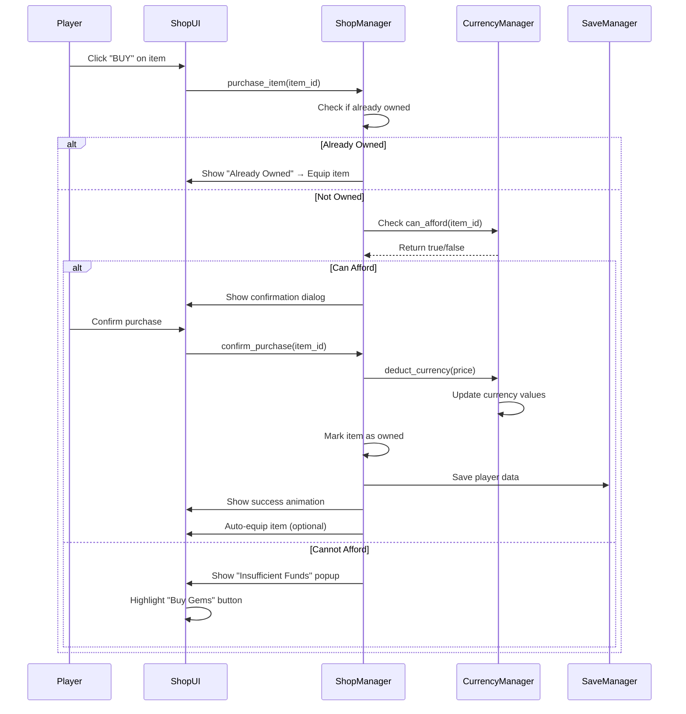

# Pinball Game v2.0 - Monetization Design

## 1. Overview

Pinball v2.0 implements a comprehensive monetization system that balances revenue generation with fair, non-predatory gameplay. The system provides multiple revenue streams while ensuring free players can fully enjoy and progress in the game.

### 1.1 Monetization Philosophy

- **Non-Predatory**: Free players can progress without paying
- **Value-Based**: Paid items provide meaningful but balanced advantages
- **Optional**: No forced purchases or paywalls blocking gameplay
- **Transparent**: Clear pricing and value communication
- **Sustainable**: Long-term player retention through fair progression

### 1.2 Revenue Models

| Model | Implementation | Fit for Pinball | Player Impact |
|-------|----------------|-----------------|---------------|
| **In-App Purchases (IAP)** | Gem packages, starter packs | Excellent | Optional premium currency |
| **Rewarded Ads** | Watch for coins/gems/extra ball | Strong | Voluntary, rewarding |
| **Interstitial Ads** | Between game sessions | Moderate | Non-intrusive timing |
| **Battle Pass** | Season-based progression | Good | Long-term engagement |
| **Cosmetic Customization** | Visual-only items | Good | Personalization |

---

## 2. Currency System Design

### 2.1 Dual Currency Model

#### Coins (Earnable Currency)
- **Purpose**: Primary earnable currency for common purchases
- **Earning Methods**:
  - Score conversion: 1 coin per 100 points scored
  - Hold entry bonus: Hold point value / 10 coins
  - Daily login: 100-500 coins (scaling with streak)
  - Daily challenges: 50-200 coins per challenge (3 challenges/day)
  - Rewarded ads: 250 coins per ad (max 3 ads/day)
  - Battle Pass free track: 100-500 coins per tier
- **Daily Earning Potential**: 
  - Base gameplay: ~500-2000 coins (depends on skill)
  - Daily login: 100-500 coins
  - Daily challenges: 150-600 coins
  - Rewarded ads: 750 coins (3 ads × 250)
  - **Total**: ~1500-3850 coins/day (free players)
- **Usage**:
  - Common ball upgrades: 500-1000 coins
  - Common flipper upgrades: 1000 coins
  - Cosmetic items: 200-500 coins
  - Special ramps (session): 100-300 coins per activation
- **Balance**: Players can earn enough coins to purchase 1-2 common upgrades per day

#### Gems (Premium Currency)
- **Purpose**: Premium currency for exclusive items and premium purchases
- **Earning Methods**:
  - Rewarded ads: 5 gems per ad (max 3 ads/day = 15 gems/day)
  - Daily login: 10-50 gems (rare, high streak days only)
  - Battle Pass free track: 5-25 gems per tier (rare drops)
  - Battle Pass premium track: 50-200 gems per tier (requires premium unlock)
  - In-App Purchase: Direct purchase (see IAP section)
- **Daily Earning Potential** (Free Players):
  - Rewarded ads: 15 gems/day
  - Daily login (Day 7): 50 gems (weekly)
  - Battle Pass free track: ~10-50 gems per season (rare)
  - **Total**: ~15-20 gems/day average
- **Usage**:
  - Premium ball upgrades: 50-300 gems
  - Premium flipper upgrades: 75-200 gems
  - Battle Pass premium unlock: 100 gems per season
  - Premium cosmetics: 50-150 gems
  - Limited-time offers: 100-500 gems
- **Balance**: Free players can earn ~450-600 gems per month (enough for 1-2 premium items or Battle Pass unlock)

### 2.2 Currency Conversion Rates

| IAP Purchase | Price (USD) | Gems | Bonus Gems | Coins Equivalent* |
|--------------|-------------|------|------------|-------------------|
| Small Pack | $0.99 | 100 | 0 | ~6,500 coins |
| Medium Pack | $4.99 | 550 | 50 (9%) | ~36,300 coins |
| Large Pack | $9.99 | 1200 | 200 (17%) | ~79,200 coins |
| Mega Pack | $19.99 | 2500 | 500 (20%) | ~165,000 coins |

*Conversion: 1 gem ≈ 65 coins (based on item pricing)

### 2.3 Economic Balance

**Free Player Progression**:
- Can earn ~450-600 gems/month through free methods
- Can purchase 1-2 premium items per month OR Battle Pass unlock
- Common items fully accessible through coin earnings
- Gameplay experience not gated by currency

**Paying Player Benefits**:
- Faster progression (can purchase multiple premium items immediately)
- Exclusive cosmetics and limited-time offers
- Battle Pass premium track rewards
- Time savings (less grinding for currency)

**Balance Principles**:
- No pay-to-win mechanics (upgrades provide advantages but don't break balance)
- Free players can achieve same gameplay results with time investment
- Paying players get convenience and exclusivity, not overpowered advantages

---

## 3. Shop System Design

### 3.1 Shop Scene Architecture

#### Scene Hierarchy
```
ShopScene (Node2D)
├── CanvasLayer (UI Layer)
│   ├── ColorRect (Background overlay - 80% opacity dark)
│   ├── VBoxContainer (Main layout)
│   │   ├── HeaderContainer (HBoxContainer)
│   │   │   ├── BackButton (TextureButton) ← Returns to Main Menu
│   │   │   ├── Label "PINBALL SHOP" (Center)
│   │   │   └── CurrencyDisplay (HBoxContainer)
│   │   │       ├── CoinIcon (TextureRect)
│   │   │       ├── Label "Coins: {amount}"
│   │   │       ├── GemIcon (TextureRect)
│   │   │       └── Label "Gems: {amount}"
│   │   ├── TabContainer (Category switching)
│   │   │   ├── "Balls" Tab
│   │   │   ├── "Flippers" Tab
│   │   │   ├── "Ramps" Tab
│   │   │   ├── "Cosmetics" Tab
│   │   │   └── "Specials" Tab
│   │   └── FooterContainer (HBoxContainer)
│   │       ├── BuyCoinsButton (opens gem packages)
│   │       └── BuyGemsButton (opens IAP menu)
│   └── PurchasePopup (PopupPanel - appears on purchase)
│       └── PurchaseConfirmationDialog
├── AudioStreamPlayer (Shop music/UI sounds)
└── ShopManager (Node with script)
```

### 3.2 Item Categories

#### Category 1: Balls
**Items**:
- Standard Ball (Default, owned by all players)
- Heavy Ball (500 coins): Increased mass (0.8), more momentum
- Bouncy Ball (1000 coins): Higher bounce (1.0), more energy retention
- Magnetic Ball (50 gems): Attraction to obstacles, special visual effects
- Fire Ball (150 gems): Chain reactions, burn effects, score multiplier
- Cosmic Ball (300 gems): Anti-gravity, time warp, exclusive visual effects

**Item Card Display**:
- Icon (64×64 pixels)
- Name
- Stats preview (Mass, Bounce, Special ability)
- Price (Coins or Gems icon + amount)
- Button: "BUY" / "OWNED" / "EQUIP" (if owned)
- Tooltip on hover (detailed stats)

#### Category 2: Flippers
**Items**:
- Standard Flipper (Default, owned by all players)
- Long Flipper (1000 coins): Wider hitbox (length: 80px)
- Power Flipper (50 gems): Increased impulse force (+30%)
- Twin Flipper (75 gems): Secondary segment, dual-hit capability
- Plasma Flipper (150 gems): Plasma visual effects, electric arcs
- Turbo Flipper (200 gems): Faster rotation speed (+50%)

**Item Card Display**:
- Icon showing flipper variant
- Name
- Stats preview (Length, Power, Rotation Speed)
- Special abilities
- Price and purchase button

#### Category 3: Ramps
**Items** (Session-based activations):
- Multiplier Ramp (100 coins per session): 2× score for 10 seconds
- Bank Shot Ramp (200 coins per session): Guides ball to target hold
- Accelerator Ramp (150 coins per session): +50% ball speed boost

**Item Card Display**:
- Ramp preview visual
- Name and description
- Activation cost (coins)
- "ACTIVATE" button (if owned/available)
- Note: "Session-based: Effect lasts for current game"

#### Category 4: Cosmetics
**Subcategories**:
- **Ball Trails**: Standard (free), Fire (200 coins), Electric (300 coins), Rainbow (500 coins), Galaxy (50 gems)
- **Table Skins**: Classic (default), Neo-Noir (300 coins), Cyberpunk (75 gems), Nature (200 coins), Space (100 gems)
- **Flipper Skins**: Visual-only customization (200-500 coins)
- **Sound Packs**: Theme-based audio replacements (100-300 coins)

#### Category 5: Specials
**Items**:
- Starter Pack ($2.99 IAP): 500 gems + Heavy Ball + Long Flipper
- Premium Starter ($4.99 IAP): 1000 gems + Magnetic Ball + Power Flipper
- Limited-Time Offers: Time-limited discounted items
- Gem Packages: Direct gem purchases (see IAP section)

### 3.3 Item Database Structure

#### JSON Format
```json
{
  "items": {
    "ball_heavy": {
      "id": "ball_heavy",
      "name": "Heavy Ball",
      "category": "ball",
      "tier": "common",
      "price": {
        "currency": "coins",
        "amount": 500
      },
      "owned": false,
      "equipped": false,
      "physics_stats": {
        "mass": 0.8,
        "bounce": 0.8,
        "linear_damp": 0.07,
        "gravity_scale": 1.0
      },
      "visual_stats": {
        "icon": "res://assets/shop/icons/ball_heavy.png",
        "texture": null,
        "trail_type": "standard"
      },
      "special_abilities": [],
      "description": "Increased mass for more momentum and harder hits."
    },
    "ball_magnetic": {
      "id": "ball_magnetic",
      "name": "Magnetic Ball",
      "category": "ball",
      "tier": "premium",
      "price": {
        "currency": "gems",
        "amount": 50
      },
      "owned": false,
      "equipped": false,
      "physics_stats": {
        "mass": 0.6,
        "bounce": 0.75,
        "linear_damp": 0.07,
        "gravity_scale": 1.0
      },
      "visual_stats": {
        "icon": "res://assets/shop/icons/ball_magnetic.png",
        "texture": null,
        "trail_type": "electric"
      },
      "special_abilities": [
        {
          "type": "magnetic_attraction",
          "force": 150.0,
          "radius": 150.0
        }
      ],
      "description": "Attracts to obstacles within range. Perfect for combo scoring!"
    },
    "flipper_twin": {
      "id": "flipper_twin",
      "name": "Twin Flipper",
      "category": "flipper",
      "tier": "premium",
      "price": {
        "currency": "gems",
        "amount": 75
      },
      "owned": false,
      "equipped": false,
      "physics_stats": {
        "length": 64,
        "secondary_length": 30,
        "rotation_speed": 20.0,
        "power_multiplier": 1.0
      },
      "visual_stats": {
        "icon": "res://assets/shop/icons/flipper_twin.png",
        "texture": "res://assets/shop/flippers/twin.png"
      },
      "special_abilities": [
        {
          "type": "dual_segment",
          "secondary_angle_offset": 15.0
        }
      ],
      "description": "Two-segment flipper for wider coverage and dual-hit capability."
    }
  }
}
```

#### Resource Format (Godot)
```gdscript
# ItemData.gd (Resource)
extends Resource
class_name ItemData

@export var item_id: String
@export var name: String
@export var category: String  # "ball", "flipper", "ramp", "cosmetic"
@export var tier: String  # "common", "premium", "exclusive"
@export var price_coins: int = 0
@export var price_gems: int = 0
@export var physics_stats: Dictionary = {}
@export var visual_stats: Dictionary = {}
@export var special_abilities: Array = []
@export var description: String = ""
```

### 3.4 Purchase Flow

#### Purchase Sequence Diagram


#### Purchase Confirmation Dialog
- **Title**: "Confirm Purchase"
- **Item Preview**: Icon, name, stats
- **Price Display**: Currency icon + amount (highlighted)
- **Current Balance**: "Your balance: {currency} {amount}"
- **Buttons**: 
  - "CANCEL" (closes dialog)
  - "BUY" (proceeds with purchase, highlighted)
- **Post-Purchase**: Success animation, "Item Purchased!" message, item auto-equipped (optional)

### 3.5 Equip/Unequip System

#### Equipping Items
- Items can be equipped in Shop or Customize scene
- Only one item per category can be equipped at a time
- Equipping an item automatically unequips the previous item
- Equipped items are saved to GlobalGameSettings
- Equipped items take effect in the next game session

#### Customize Scene
- Dedicated scene for managing equipped items
- Shows all owned items by category
- Preview of equipped items
- "EQUIP" / "UNEQUIP" buttons
- Visual preview of how equipped items look in-game

---

## 4. In-App Purchase (IAP) System

### 4.1 Product Catalog

#### Gem Packages
| Package | Gems | Price (USD) | Bonus | Value Rating |
|---------|------|-------------|-------|--------------|
| Small Pack | 100 | $0.99 | 0 | Standard |
| Medium Pack | 550 | $4.99 | 50 (9%) | Best Value |
| Large Pack | 1200 | $9.99 | 200 (17%) | Good Value |
| Mega Pack | 2500 | $19.99 | 500 (20%) | Maximum Value |

#### Starter Packs (One-Time Purchase)
| Pack | Contents | Price (USD) | Value |
|------|----------|-------------|-------|
| Starter Pack | 500 gems + Heavy Ball + Long Flipper | $2.99 | ~$7.98 value |
| Premium Starter | 1000 gems + Magnetic Ball + Power Flipper | $4.99 | ~$15.97 value |

#### Battle Pass Unlock
- **Premium Track**: 100 gems per season
- Can be purchased with earned gems or IAP gems
- Unlocks premium track rewards for current season

### 4.2 Platform-Specific IAP Integration

#### iOS (StoreKit)
- **Framework**: StoreKit 2 (iOS 15+) or StoreKit 1 (iOS 13-14)
- **Product IDs**: 
  - `com.company.pinball.gems_small`
  - `com.company.pinball.gems_medium`
  - `com.company.pinball.gems_large`
  - `com.company.pinball.gems_mega`
  - `com.company.pinball.starter_pack`
  - `com.company.pinball.premium_starter`
- **Purchase Flow**:
  1. Request product information from App Store
  2. Display products with localized prices
  3. Initiate purchase via StoreKit
  4. Handle purchase result (success/failure/cancelled)
  5. Validate receipt with App Store
  6. Grant currency to player
  7. Save purchase record
- **Receipt Validation**: Server-side validation recommended for production
- **Restore Purchases**: "Restore Purchases" button in settings

#### Android (Google Play Billing)
- **Library**: Google Play Billing Library 5.0+
- **Product IDs** (same as iOS):
  - `com.company.pinball.gems_small`
  - `com.company.pinball.gems_medium`
  - etc.
- **Purchase Flow**:
  1. Query product details from Google Play
  2. Display products with localized prices
  3. Launch billing flow
  4. Handle purchase result (success/failure/cancelled)
  5. Acknowledge purchase (required by Google)
  6. Grant currency to player
  7. Save purchase record
- **Receipt Validation**: Purchase tokens validated server-side (recommended)
- **Restore Purchases**: Purchases restored automatically on app launch

### 4.3 IAP Abstraction Layer

#### Design Pattern
```gdscript
# IAPManager.gd (Abstract base)
extends Node

signal purchase_completed(product_id: String, success: bool)
signal purchase_failed(product_id: String, error: String)
signal products_loaded(products: Array)

func initialize() -> void:
    # Platform-specific initialization
    pass

func load_products() -> void:
    # Platform-specific product loading
    pass

func purchase_product(product_id: String) -> void:
    # Platform-specific purchase flow
    pass

func restore_purchases() -> void:
    # Platform-specific restore
    pass

# iOS Implementation: IAPManagerIOS.gd extends IAPManager
# Android Implementation: IAPManagerAndroid.gd extends IAPManager
```

#### Platform Detection
```gdscript
# In IAPManager initialization
func _ready():
    match OS.get_name():
        "iOS":
            # Use StoreKit implementation
            pass
        "Android":
            # Use Google Play Billing implementation
            pass
        _:
            # Desktop/Development: Mock implementation
            pass
```

### 4.4 Purchase Flow

```
1. Player taps "Buy Gems" button
2. ShopManager requests product catalog from IAPManager
3. IAPManager loads products from platform store
4. ShopManager displays product list with prices
5. Player selects product (e.g., "Medium Pack - $4.99")
6. ShopManager calls IAPManager.purchase_product(product_id)
7. Platform shows native purchase dialog
8. Player confirms purchase
9. Platform processes payment
10. IAPManager receives purchase result
11. IAPManager validates receipt (server-side recommended)
12. CurrencyManager grants gems to player
13. SaveManager saves purchase record
14. ShopManager shows success message
15. Currency display updates
```

### 4.5 Security Considerations

- **Receipt Validation**: Server-side validation for production (prevents fraud)
- **Purchase Records**: Store purchase history locally and server-side
- **Restore Purchases**: Verify purchases on app reinstall
- **Anti-Fraud**: Detect suspicious purchase patterns
- **Encryption**: Encrypt save data containing purchase records

---

## 5. Advertisement Integration System

### 5.1 Rewarded Ads

#### Ad Types and Rewards

| Ad Type | Reward | Daily Limit | Placement |
|---------|--------|-------------|-----------|
| Watch for Coins | 250 coins | 3 ads/day | Shop, After ball loss, Main menu |
| Watch for Gems | 5 gems | 3 ads/day | Same as coins (shared limit) |
| Watch for Extra Ball | Revive current ball | 1 per game session | After ball loss only |

#### Ad Placement

**After Ball Loss**:
- Button appears for 5 seconds after ball is lost
- Text: "Watch Ad for Extra Ball" or "Watch Ad for 250 Coins"
- Disappears if player releases next ball or timeout
- Only shown if ad is available and limit not reached

**Shop Scene**:
- "Watch Ad" button in currency display area
- Shows available rewards and remaining ad count
- Button disabled when daily limit reached
- Resets at midnight local time

**Main Menu**:
- "Watch Ad" button in daily rewards section
- Shows remaining ad count for the day

#### Ad Providers

**Primary**: Google AdMob
- Rewarded video ads
- High fill rate, good revenue
- Easy integration with Godot

**Secondary**: Unity Ads (fallback)
- Used if AdMob fails to load
- Similar rewarded video format
- Cross-platform support

#### Ad Display Flow

```
1. Player taps "Watch Ad" button
2. AdManager checks if ad available and limit not reached
3. AdManager requests ad from provider (AdMob or Unity Ads)
4. Ad loads (may take 2-5 seconds)
5. Full-screen ad video plays (15-30 seconds)
6. Player can skip after minimum watch time (varies by ad)
7. Ad completes (watched fully or minimum time reached)
8. AdManager receives reward callback
9. CurrencyManager grants reward (coins/gems/extra ball)
10. SaveManager saves ad watch record (for daily limit)
11. UI shows reward notification ("+250 Coins!")
12. Ad button updates remaining count
```

#### Ad Cooldowns and Limits

- **Daily Limit**: 3 rewarded ads per day (total, not per type)
- **Cooldown**: 1 minute between ads (prevents accidental multiple watches)
- **Reset Time**: Midnight local time
- **Availability Check**: Ad must be loaded before showing button
- **Failure Handling**: If ad fails to load, show error message, don't grant reward

### 5.2 Interstitial Ads

#### Ad Placement Timing

- **When**: After game session ends (all balls lost)
- **Frequency**: Every 3rd game session
- **Cooldown**: Minimum 1 hour between interstitial ads
- **Not Shown**: During active gameplay, during pause, or during shop navigation

#### Ad Display Rules

- Only show between natural game breaks
- Never interrupt active gameplay
- Player can skip after 5 seconds (if ad allows)
- Full-screen overlay, cannot be dismissed early (unless skippable)
- Duration: 15-30 seconds typically

#### Implementation

```
1. Game session ends (all balls lost)
2. GameManager checks interstitial ad conditions:
   - Is it the 3rd session since last ad?
   - Has 1 hour passed since last interstitial?
   - Is player not in a critical flow?
3. If conditions met, AdManager requests interstitial ad
4. Ad loads (may take 2-5 seconds)
5. Full-screen ad displays
6. Player watches or skips (after 5 seconds if allowed)
7. Ad closes automatically or when skipped
8. Return to main menu or session summary
```

### 5.3 Ad Abstraction Layer

#### Design Pattern
```gdscript
# AdManager.gd (Abstract base)
extends Node

signal rewarded_ad_completed(reward_type: String, amount: int)
signal rewarded_ad_failed(error: String)
signal interstitial_ad_closed()

var rewarded_ads_watched_today: int = 0
var last_interstitial_time: float = 0.0
var games_since_last_interstitial: int = 0

func initialize() -> void:
    # Platform-specific ad SDK initialization
    pass

func load_rewarded_ad() -> void:
    # Load rewarded ad from provider
    pass

func show_rewarded_ad(reward_type: String) -> void:
    # Show rewarded ad
    pass

func load_interstitial_ad() -> void:
    # Load interstitial ad
    pass

func show_interstitial_ad() -> void:
    # Show interstitial ad if conditions met
    pass

func can_show_rewarded_ad() -> bool:
    return rewarded_ads_watched_today < 3

func can_show_interstitial_ad() -> bool:
    var time_passed = Time.get_ticks_msec() / 1000.0 - last_interstitial_time
    return games_since_last_interstitial >= 3 and time_passed >= 3600.0
```

#### Platform Integration
- **iOS**: AdMob SDK via GDNative/Godot plugin
- **Android**: AdMob SDK via GDNative/Godot plugin
- **Development/Desktop**: Mock implementation (shows test ad or simulates)

### 5.4 Ad Revenue Optimization

- **Ad Placement**: Balance between revenue and user experience
- **Frequency Capping**: Don't overwhelm players with ads
- **Reward Value**: Ensure rewards feel valuable (250 coins = meaningful progress)
- **Loading Times**: Pre-load ads to minimize wait times
- **Fill Rates**: Use multiple ad networks to maximize fill rate

---

## 6. Battle Pass / Season Pass System

### 6.1 Season Structure

#### Season Duration
- **Length**: 30 days per season
- **Start Date**: First day of month (or customizable)
- **End Date**: Last day of 30-day period
- **Reset**: New season begins immediately after previous season ends

#### Tier System
- **Total Tiers**: 50 tiers per season
- **Progression**: Linear XP requirements (each tier requires more XP)
- **XP Requirements**: 
  - Tier 1: 100 XP
  - Tier 2: 150 XP
  - Tier 3: 200 XP
  - ... (increasing by 50 XP per tier)
  - Tier 50: 2,550 XP
- **Total XP Needed**: ~66,250 XP to complete all 50 tiers

### 6.2 Reward Tracks

#### Free Track (Always Available)
**Rewards per Tier**:
- Tiers 1-10: 100-200 coins, common items
- Tiers 11-25: 200-500 coins, standard upgrades, 5-10 gems (rare)
- Tiers 26-40: 500-1000 coins, better upgrades, 10-25 gems
- Tiers 41-50: 1000-2000 coins, premium items (unlock tokens), 25-50 gems

**Total Free Track Value**: ~15,000 coins, ~200 gems, multiple items

#### Premium Track (Unlock with 100 gems)
**Rewards per Tier**:
- Tiers 1-10: Exclusive cosmetic items, 50-100 gems, premium upgrade tokens
- Tiers 11-25: Exclusive ball/flipper variants, 100-150 gems, premium cosmetics
- Tiers 26-40: Exclusive limited items, 150-200 gems, rare upgrades
- Tiers 41-50: Season-exclusive items (never available again), 200-300 gems, premium items

**Total Premium Track Value**: ~5,000 gems, exclusive items worth ~10,000 coins equivalent

### 6.3 XP Earning

#### Earning Methods
- **Score-based**: 1 XP per 50 points scored
- **Obstacle hits**: 1 XP per 10 obstacle hits
- **Hold entries**: 10 XP per hold entry
- **Daily challenges**: 50-200 XP per challenge completion
- **Daily login**: 25 XP bonus
- **First game of day**: 50 XP bonus

#### Daily XP Potential
- **Average gameplay session**: 5000 points = 100 XP
- **Obstacle hits**: ~50 hits = 5 XP
- **Hold entries**: 2 entries = 20 XP
- **Daily challenges**: 3 challenges = 300 XP (average)
- **Daily login**: 25 XP
- **Total**: ~450 XP/day (can complete season in ~147 days = ~5 months)

**Note**: Season is 30 days, so players need to play actively to complete. Free players can complete ~15-20 tiers, paying players (with premium track) get more value and can complete more tiers.

### 6.4 Battle Pass UI

#### Main Battle Pass Scene
- **Layout**: Vertical scrolling list of tiers
- **Display**: 
  - Current tier highlighted
  - XP progress bar for current tier
  - Locked tiers grayed out
  - Completed tiers checked/green
- **Rewards**: 
  - Free track rewards on left
  - Premium track rewards on right (locked if not purchased)
- **Buttons**:
  - "Claim" button on unlocked tiers (if not claimed)
  - "Unlock Premium" button (if premium not purchased)
  - "Back" button to main menu

#### In-Game Battle Pass Display
- **XP Bar**: Top-right corner, below currency
- **Current Tier**: "Tier {current}/50"
- **XP Progress**: "{current_xp}/{tier_xp_needed} XP"
- **Tap/Click**: Opens full Battle Pass scene

### 6.5 Battle Pass Progression Flow

```
1. Player earns XP from gameplay
2. BattlePassManager tracks XP
3. When XP threshold reached, tier unlocks
4. BattlePassManager emits tier_unlocked signal
5. UI shows tier unlock notification
6. Player can claim rewards from unlocked tier
7. If premium track purchased, player can claim premium rewards too
8. Rewards granted to player (currency/items)
9. SaveManager saves Battle Pass progress
10. Next tier XP requirement becomes active
```

### 6.6 Season Reset

- **End of Season**: All unearned rewards are lost
- **Progress Reset**: XP resets to 0, start at Tier 1
- **Owned Items**: Purchased items and claimed rewards remain owned
- **New Season**: New rewards, new exclusive items
- **Carry-Over**: Premium track purchase does NOT carry over (must purchase each season)

---

## 7. Daily Systems

### 7.1 Daily Login Rewards

#### Streak System
| Day | Coins | Gems | Bonus |
|-----|-------|------|-------|
| Day 1 | 100 | 0 | - |
| Day 2 | 150 | 0 | - |
| Day 3 | 200 | 10 | - |
| Day 4 | 250 | 0 | - |
| Day 5 | 300 | 20 | - |
| Day 6 | 400 | 0 | - |
| Day 7 | 500 | 50 | Exclusive item* |

*Exclusive item rotates weekly (cosmetic, upgrade token, etc.)

#### Streak Mechanics
- **Reset**: Missing a day resets streak to Day 1
- **Tracking**: Streak tracked locally and server-side (if cloud save implemented)
- **Claim Window**: 24 hours to claim daily reward (resets at midnight local time)
- **Notification**: Badge on main menu if reward available

#### Implementation
```gdscript
# DailyLoginManager.gd
var current_streak: int = 0
var last_login_date: String = ""
var reward_claimed_today: bool = false

func check_daily_login() -> void:
    var today = Time.get_datetime_string_from_system()
    var today_date = today.split(" ")[0]  # Get date part
    
    if last_login_date != today_date:
        if is_consecutive_day(today_date):
            current_streak += 1
        else:
            current_streak = 1  # Reset streak
        
        last_login_date = today_date
        reward_claimed_today = false
        
        show_daily_reward_claim()
    else:
        if not reward_claimed_today:
            show_daily_reward_claim()
```

### 7.2 Daily Challenges

#### Challenge Types

**Score Challenges**:
- "Score 5,000 points in one game" (50 XP, 100 coins)
- "Score 10,000 points in one game" (100 XP, 200 coins)
- "Score 15,000 points total today" (75 XP, 150 coins)

**Obstacle Challenges**:
- "Hit 50 obstacles total" (25 XP, 50 coins)
- "Hit 20 basketball hoops" (50 XP, 100 coins)
- "Hit 100 obstacles without losing ball" (100 XP, 200 coins)

**Hold Challenges**:
- "Enter 3 holds" (50 XP, 150 coins)
- "Enter a 30-point hold" (75 XP, 200 coins)

**Combo Challenges**:
- "Hit 10 obstacles without losing ball" (75 XP, 200 coins)
- "Score 5,000 points in under 2 minutes" (100 XP, 250 coins)

#### Challenge System
- **Count**: 3 challenges per day
- **Refresh**: New challenges at midnight local time
- **Auto-Completion**: Challenges track progress automatically
- **Rewards**: XP and coins awarded immediately upon completion
- **Difficulty**: Mix of easy, medium, and hard challenges

#### Implementation
```gdscript
# ChallengeManager.gd
var daily_challenges: Array[Dictionary] = []
var challenge_progress: Dictionary = {}

func generate_daily_challenges() -> void:
    daily_challenges.clear()
    # Generate 3 random challenges from challenge pool
    for i in range(3):
        var challenge = get_random_challenge()
        daily_challenges.append(challenge)
        challenge_progress[challenge.id] = 0

func update_challenge_progress(challenge_id: String, amount: int) -> void:
    if challenge_progress.has(challenge_id):
        challenge_progress[challenge_id] += amount
        var challenge = get_challenge_by_id(challenge_id)
        
        if challenge_progress[challenge_id] >= challenge.target:
            complete_challenge(challenge_id)
```

---

## 8. Economic Balance and Player Progression

### 8.1 Free Player Progression Timeline

**Week 1**:
- Earn ~10,500 coins, ~105 gems
- Can purchase: Heavy Ball (500), Bouncy Ball (1000), Long Flipper (1000), basic cosmetics
- Battle Pass: Reach Tier 5-7

**Month 1**:
- Earn ~45,000 coins, ~450 gems
- Can purchase: All common items, 1-2 premium items, Battle Pass premium unlock
- Battle Pass: Complete ~15-20 tiers (free track)

**Month 3**:
- Earn ~135,000 coins, ~1,350 gems
- Can purchase: Most premium items, multiple Battle Pass unlocks
- Battle Pass: Complete multiple seasons, collect exclusive items

### 8.2 Paying Player Benefits

**Small Spender ($5/month)**:
- Purchase Battle Pass premium each month (100 gems)
- Earn ~600 gems/month free + 550 gems from IAP = 1,150 gems/month
- Can purchase 3-4 premium items per month
- Faster progression, exclusive items

**Medium Spender ($15/month)**:
- Battle Pass + Large Pack each month
- Can purchase most premium items immediately
- Complete Battle Pass seasons faster
- Access to all content

**Large Spender ($30+/month)**:
- Multiple gem packs, all Battle Passes
- Immediate access to all items
- Collection completion
- Time savings (no grinding)

### 8.3 Balance Principles

1. **No Pay-to-Win**: Upgrades provide advantages but don't break game balance
2. **Time = Money**: Free players can achieve same results with time investment
3. **Meaningful Progression**: Both free and paying players feel progress
4. **Value Perception**: Paid items feel valuable, not overpriced
5. **Sustained Engagement**: Daily systems keep players coming back
6. **Fair Economy**: Currency earning rates balanced with item costs

---

## 9. Analytics and Metrics

### 9.1 Key Metrics to Track

**Monetization Metrics**:
- ARPU (Average Revenue Per User)
- ARPPU (Average Revenue Per Paying User)
- Conversion Rate (free to paying)
- IAP transaction frequency
- Ad revenue per user
- Battle Pass purchase rate

**Engagement Metrics**:
- Daily Active Users (DAU)
- Retention (Day 1, Day 7, Day 30)
- Session length
- Sessions per day
- Currency earning rates
- Battle Pass completion rates

**Balance Metrics**:
- Average coins/gems earned per day (free players)
- Time to first purchase
- Item purchase distribution
- Upgrade usage rates
- Ad watch frequency

### 9.2 A/B Testing Opportunities

- Gem package pricing
- Rewarded ad reward amounts
- Battle Pass XP requirements
- Daily challenge difficulty
- Item pricing (coins vs gems)
- Ad placement timing

---

## 10. Implementation Roadmap

### Phase 1: Foundation (Weeks 1-2)
- Currency system (Coins and Gems)
- Basic shop scene structure
- Item database system
- Save/load system for currency

### Phase 2: Shop System (Weeks 3-4)
- Complete shop UI implementation
- Purchase flow
- Equip/unequip system
- Item ownership tracking

### Phase 3: IAP Integration (Weeks 5-6)
- Platform abstraction layer
- iOS StoreKit integration
- Android Google Play Billing integration
- Receipt validation system

### Phase 4: Ad Integration (Weeks 7-8)
- Ad abstraction layer
- AdMob SDK integration
- Rewarded ads implementation
- Interstitial ads implementation

### Phase 5: Battle Pass (Weeks 9-10)
- Battle Pass scene and UI
- XP tracking system
- Tier progression
- Reward claiming system

### Phase 6: Daily Systems (Weeks 11-12)
- Daily login system
- Daily challenges
- Streak tracking
- Challenge progress tracking

### Phase 7: Polish and Testing (Weeks 13-14)
- Balance tuning
- UI polish
- Analytics integration
- Beta testing with real users

---

*This monetization system is designed to be fair, sustainable, and profitable while maintaining player satisfaction and long-term engagement.*
