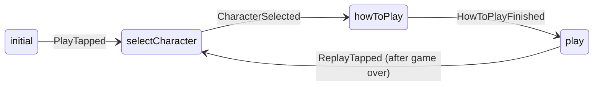
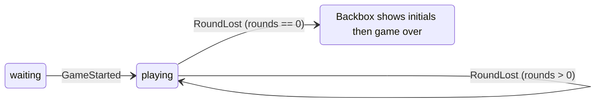
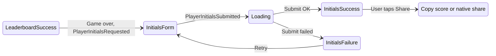
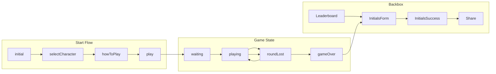

# Pinball Game v4.0 – Game Flow and State Management

## 1. Flow Overview

v4.0 flow matches Flutter I/O Pinball: Start flow (initial → character select → how to play → play), Game state (waiting → playing → round lost → playing or game over), Backbox (leaderboard → initials → game over info → share).

---

## 2. Start Flow (StartGameBloc)

### 2.1 States

| State | Description |
|-------|-------------|
| initial | App started; Play button visible |
| selectCharacter | User must pick Sparky, Dino, Dash, or Android |
| howToPlay | How to Play screen; user dismisses to continue |
| play | Game starts; load playfield, camera to playfield, game status = playing |

### 2.2 Transitions

### 2.3 Sequence

1. **Initial**: Show main/start screen with Play.
2. **PlayTapped**: Navigate to Character Select.
3. **CharacterSelected**: Store theme (ball + leaderboard icon); navigate to How to Play.
4. **HowToPlayFinished**: Load game scene; set StartFlow = play; set Game status = playing; spawn ball at launcher; camera to playfield.
5. **ReplayTapped**: After game over, return to Character Select (same as PlayTapped from initial).

---

## 3. Game State (GameBloc)

### 3.1 Status

| Status | Description |
|--------|-------------|
| waiting | Before first ball in play (e.g. camera on backbox/top) |
| playing | Ball(s) in play; scoring and multiplier active |
| gameOver | Rounds = 0; backbox shows initials then game over info |

### 3.2 Data

- **round_score**: int, reset each round.
- **total_score**: int, persists; on round lost: total_score += round_score * multiplier (capped 9999999999).
- **multiplier**: int 1–6; reset to 1 on round lost; increase by ramp (every 5 ramp hits, max 6).
- **rounds**: int, initial 3; decrement on round lost.
- **bonus_history**: list of bonuses (googleWord, dashNest, sparkyTurboCharge, dinoChomp, androidSpaceship).
- **display_score**: round_score + total_score.

### 3.3 Transitions

### 3.4 Events and Effects

| Event | Effect |
|-------|--------|
| GameStarted | status = playing; spawn ball at launcher |
| Scored(points) | round_score += points (only when playing) |
| MultiplierIncreased | multiplier = min(6, multiplier + 1) (only when playing) |
| BonusActivated(bonus) | bonus_history.append(bonus); if googleWord/dashNest start 5s bonus ball timer |
| RoundLost | total_score += round_score * multiplier; round_score = 0; multiplier = 1; rounds -= 1; if rounds == 0 then status = gameOver else spawn ball |
| GameOver | status = gameOver; trigger Backbox initials flow |

---

## 4. Round Life Cycle

1. **Round start**: Ball spawns at launcher (plunger position). Player launches ball.
2. **During round**: Ball hits targets (skill shot, rollovers, bumpers, ramp, dino, computer, spaceship); scoring adds to round_score; ramp hits every 5 increase multiplier; bonuses recorded; bonus ball may spawn 5s after Google Word or Dash Nest.
3. **Ball drains**: Drain removes ball. If no balls left → RoundLost.
4. **RoundLost**: total_score += round_score * multiplier; round_score = 0; multiplier = 1; rounds -= 1. If rounds > 0 → spawn new ball (back to step 1). If rounds == 0 → status = gameOver → Backbox initials flow.

---

## 5. Bonus Ball Flow

1. **Trigger**: Google Word (all letters lit) or Dash Nest (all Dash bumpers lit).
2. **Effect**: GameManager adds bonus to bonus_history; emits bonus_activated.
3. **Timer**: Start 5-second timer.
4. **Spawn**: After 5s, spawn one Ball at DinoWalls position (e.g. 29.2, -24.5) with impulse (e.g. (-40, 0)) toward center; add to playfield.
5. **Indicators**: Multiball indicators (4) animate when bonus is googleWord or dashNest (e.g. blink).

---

## 6. Multiplier Flow

1. **Source**: SpaceshipRamp in Android Acres; each ball entry counts as one hit.
2. **Rule**: Every 5 ramp hits → MultiplierIncreased (if multiplier < 6).
3. **Effect**: GameManager.multiplier += 1 (capped 6); emit multiplier_increased; UI updates.
4. **Reset**: On RoundLost, multiplier = 1.

---

## 7. Backbox Flow (BackboxBloc)

### 7.1 States

| State | Description |
|-------|-------------|
| LeaderboardSuccess(entries) | Top 10 entries loaded (initial or after load) |
| LeaderboardFailure | Load failed or no backend |
| Loading | Submitting initials |
| InitialsForm(score, character) | Game over; show initials input |
| InitialsSuccess(score) | Initials submitted; show game over info |
| InitialsFailure(score, character) | Submit failed; retry initials |
| Share(score) | User tapped share; show share options |

### 7.2 Transitions

### 7.3 Sequence (Game Over)

1. GameManager emits game_over (rounds == 0).
2. Root/UI calls BackboxManager.request_initials(final_score, character).
3. BackboxManager emits InitialsForm(score, character); Backbox shows initials input.
4. User enters initials and submits → BackboxManager.submit_initials(initials).
5. BackboxManager saves to local leaderboard; emits InitialsSuccess(score); Backbox shows game over info and Share button.
6. User taps Share → BackboxManager.request_share(score); Backbox shows Share display (copy text or native share).

---

## 8. Camera Flow

| Game status | Camera focus | Zoom (reference) |
|-------------|-------------|------------------|
| waiting | Top (e.g. position (0, -112)) | size.y / 175 |
| playing | Playfield (e.g. position (0, -7.8)) | size.y / 160 |
| gameOver | Top (e.g. position (0, -111)) | size.y / 100 |

On status change, tween camera position and zoom to the row above. Use viewport size for zoom ratio.

---

## 9. High-Level Diagram

