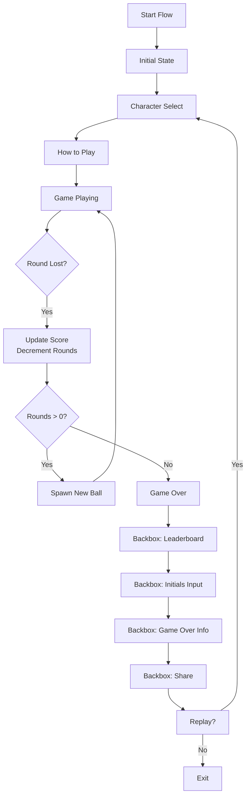

# Pinball v4.0 - Architecture Design for Feature Parity

## 1. Architecture Overview

### 1.1 Design Principles
- **Flutter Parity**: Match Flutter I/O Pinball architecture patterns in Godot
- **Modular Zones**: Each game zone as independent, testable component
- **Signal-Driven**: Loose coupling via Godot signals (equivalent to BLoC events)
- **State Isolation**: Separate game state, UI state, and backbox state
- **Asset Management**: Organized asset loading by theme and zone

### 1.2 High-Level Architecture
```
┌─────────────────────────────────────────────────────────┐
│                    Presentation Layer                    │
│  ┌─────────────┐  ┌─────────────┐  ┌─────────────┐     │
│  │   Backbox   │  │     HUD     │  │   Overlays  │     │
│  │  Manager    │  │   (UIV4)    │  │ (Mobile UI) │     │
│  └─────────────┘  └─────────────┘  └─────────────┘     │
└─────────────────────────────────────────────────────────┘
                            │
┌─────────────────────────────────────────────────────────┐
│                    Gameplay Layer                        │
│  ┌─────────────┐  ┌─────────────┐  ┌─────────────┐     │
│  │   Zones     │  │   Physics   │  │   Audio     │     │
│  │ (5 areas)   │  │  (Ball,     │  │  Manager    │     │
│  └─────────────┘  │  Flippers)  │  └─────────────┘     │
│                   └─────────────┘                       │
└─────────────────────────────────────────────────────────┘
                            │
┌─────────────────────────────────────────────────────────┐
│                    State Layer                           │
│  ┌─────────────┐  ┌─────────────┐  ┌─────────────┐     │
│  │   Game      │  │   Start     │  │   Backbox   │     │
│  │  Manager    │  │   Flow      │  │   State     │     │
│  │  (V4)       │  │             │  │             │     │
│  └─────────────┘  └─────────────┘  └─────────────┘     │
└─────────────────────────────────────────────────────────┘
                            │
┌─────────────────────────────────────────────────────────┐
│                    Data Layer                            │
│  ┌─────────────┐  ┌─────────────┐  ┌─────────────┐     │
│  │   Local     │  │   Asset     │  │   Settings  │     │
│  │  Storage    │  │   Loader    │  │             │     │
│  └─────────────┘  └─────────────┘  └─────────────┘     │
└─────────────────────────────────────────────────────────┘
```
## 2. Flutter Pinball Architecture Parity Analysis

### 2.1 Overview
This section documents the comprehensive parity analysis between the Flutter I/O Pinball reference implementation and our Godot v4.0 architecture. The analysis evaluates architectural patterns, component completeness, performance characteristics, and feature gaps.

### 2.2 Parity Scorecard Summary
| **Category** | **Parity Score** | **Status** | **Key Gaps** |
|--------------|------------------|------------|--------------|
| **State Management** | 85% | ⚡ Good | State persistence, offline sync |
| **Component Architecture** | 60% | ⚠️ Moderate | 3 zones missing, incomplete bonus systems |
| **Performance** | 40% | 🔴 Needs Work | Ball pooling, texture atlases, LOD system |
| **Firebase Integration** | 30% | 🔴 Critical | Cloud saves, leaderboards, analytics |
| **Testing** | 50% | ⚠️ Moderate | Comprehensive test suite, integration tests |
| **Assets & Theming** | 45% | ⚠️ Moderate | Missing character theme assets, animations |
| **Overall Parity** | 52% | ⚠️ Moderate | Significant gaps in cloud and performance |

### 2.3 Architectural Patterns Comparison
| **Flutter Pattern** | **Godot Equivalent** | **Parity Status** | **Implementation Notes** |
|---------------------|----------------------|-------------------|--------------------------|
| **BLoC (Business Logic Component)** | GameManagerV4 + Signals | 85% | Core state management implemented, missing persistence |
| **Provider** | Autoload Singletons | 90% | Service locator pattern well implemented |
| **Riverpod** | Signal-based reactivity | 75% | Reactive updates via signals, less type safety |
| **Flutter Widget Tree** | Godot Scene Tree | 70% | Hierarchical structure similar, different lifecycle |
| **Flutter Animations** | Godot Tween/AnimationPlayer | 60% | Basic animations present, missing complex transitions |

### 2.4 Gap Analysis Details

#### State Management Gaps
- **State Persistence**: Flutter uses Hive/SharedPreferences; Godot needs FileSystem storage
- **Offline Sync**: Flutter has background sync; Godot needs manual save/load
- **Undo/Redo**: Flutter BLoC supports state history; Godot lacks built-in state snapshots

#### Component Architecture Gaps
- **Missing Zones**: Android Spaceship, Dino Desert, Google Gallery zones incomplete
- **Bonus Systems**: Only 2/5 bonus systems fully implemented
- **Multi-ball System**: Basic implementation, missing advanced multiball mechanics

#### Performance Gaps
- **Ball Pooling**: Flutter uses object pooling; Godot instantiates/destroys balls
- **Texture Atlases**: Flutter uses sprite sheets; Godot loads individual textures
- **LOD System**: Flutter has distance-based rendering; Godot renders everything

#### Firebase Integration Gaps
- **Cloud Saves**: Missing entirely
- **Leaderboards**: Basic local leaderboards only
- **Analytics**: No event tracking
- **Remote Config**: No dynamic configuration

### 2.5 Implementation Priority Recommendations

Based on the parity analysis, the following implementation priorities are recommended to close the 48% parity gap:

#### Priority 1: Critical Foundation (Weeks 1-2)
| **Component** | **Effort** | **Impact** | **Parity Gain** |
|---------------|------------|------------|-----------------|
| **Ball Pooling System** | Medium | High | +10% Performance |
| **State Persistence** | Low | Medium | +5% State Management |
| **Basic Firebase Setup** | High | Critical | +15% Firebase |

#### Priority 2: Core Gameplay (Weeks 3-4)
| **Component** | **Effort** | **Impact** | **Parity Gain** |
|---------------|------------|------------|-----------------|
| **Complete 3 Missing Zones** | High | High | +20% Component Architecture |
| **Bonus System Completion** | Medium | Medium | +10% Component Architecture |
| **Texture Atlas System** | Medium | Medium | +8% Performance |

#### Priority 3: Polish & Optimization (Weeks 5-6)
| **Component** | **Effort** | **Impact** | **Parity Gain** |
|---------------|------------|------------|-----------------|
| **LOD System** | High | Low | +5% Performance |
| **Advanced Firebase Features** | High | Medium | +10% Firebase |
| **Comprehensive Test Suite** | Medium | Medium | +15% Testing |

#### Priority 4: Advanced Features (Weeks 7-8)
| **Component** | **Effort** | **Impact** | **Parity Gain** |
|---------------|------------|------------|-----------------|
| **Character Theme Assets** | High | Low | +10% Assets |
| **Complex Animations** | High | Low | +5% Assets |
| **Analytics Integration** | Medium | Low | +5% Firebase |

#### Expected Parity Improvement Timeline
- **Week 2**: 52% → 67% (Critical foundation)
- **Week 4**: 67% → 85% (Core gameplay)
- **Week 6**: 85% → 90% (Polish)
- **Week 8**: 90% → 95% (Advanced features)

## 4. Core Component Architecture

### 4.1 GameManagerV4 (GameBloc Equivalent)
```gdscript
# Core state management (autoload singleton)
class_name GameManagerV4 extends Node

enum Status { WAITING, PLAYING, GAME_OVER }
enum Bonus { GOOGLE_WORD, DASH_NEST, SPARKY_TURBO_CHARGE, DINO_CHOMP, ANDROID_SPACESHIP }

signal scored(points: int)
signal round_lost()
signal bonus_activated(bonus: Bonus)
signal multiplier_increased()
signal game_over()
signal game_started()

# State variables
var round_score: int = 0
var total_score: int = 0
var multiplier: int = 1
var rounds: int = 3
var bonus_history: Array[Bonus] = []
var status: Status = Status.WAITING

# Methods matching Flutter GameBloc events
func add_score(points: int) -> void
func on_round_lost() -> void
func increase_multiplier() -> void
func add_bonus(bonus: Bonus) -> void
func start_game() -> void
```

### 2.2 Zone Architecture Pattern
Each game zone follows this pattern:

```gdscript
# Zone Template (e.g., AndroidAcresV4.gd)
class_name AndroidAcresV4 extends Node2D

# Zone-specific signals
signal ramp_hit(points: int)
signal bumper_hit(points: int, bumper_id: String)
signal spaceship_target_hit(points: int)

# Zone state
var ramp_hit_count: int = 0
var bumpers_lit: Dictionary = {
    "A": false,
    "B": false, 
    "COW": false
}

func _ready():
    # Connect child components
    connect_ramp()
    connect_bumpers()
    connect_spaceship()

func connect_ramp():
    var ramp = $SpaceshipRamp
    if ramp and ramp.has_signal("body_entered"):
        ramp.connect("body_entered", _on_ramp_hit)

func _on_ramp_hit(body: Node):
    if body.is_in_group("balls"):
        ramp_hit_count += 1
        GameManagerV4.add_score(5000)
        
        # Every 5 hits increases multiplier
        if ramp_hit_count % 5 == 0:
            GameManagerV4.increase_multiplier()
```

### 4.3 Signal Mapping (Flutter Events → Godot Signals)
| **Flutter Event** | **Godot Signal** | **Emitter** | **Listener** |
|------------------|-----------------|------------|-------------|
| GameStarted | game_started | GameManagerV4 | MainV4, UIV4, Camera |
| Scored(points) | scored(points) | GameManagerV4 | UIV4, ScorePopup |
| RoundLost | round_lost | GameManagerV4 | MainV4, UIV4, Launcher |
| MultiplierIncreased | multiplier_increased | GameManagerV4 | MultipliersV4, UIV4 |
| BonusActivated(bonus) | bonus_activated(bonus) | GameManagerV4 | MultiballsV4, Backbox |
| GameOver | game_over | GameManagerV4 | MainV4, BackboxManagerV4 |

## 5. Scene Hierarchy Design

### 5.1 MainV4.tscn Structure
```
MainV4 (Node2D)
├── Camera2D (CameraFocusingBehavior)
├── Playfield (Node2D)
│   ├── Background (Sprite2D)
│   ├── Boundaries (StaticBody2D)
│   ├── BackboxDisplay (CanvasLayer)
│   ├── Zones (Node2D)
│   │   ├── AndroidAcres (Node2D, script: AndroidAcresV4.gd)
│   │   │   ├── SpaceshipRamp (Area2D)
│   │   │   ├── AndroidBumperA (RigidBody2D)
│   │   │   ├── AndroidBumperB (RigidBody2D)
│   │   │   ├── AndroidBumperCow (RigidBody2D)
│   │   │   └── AndroidSpaceship (Area2D)
│   │   ├── DinoDesert (Node2D, script: DinoDesertV4.gd)
│   │   ├── GoogleGallery (Node2D, script: GoogleGalleryV4.gd)
│   │   ├── FlutterForest (Node2D, script: FlutterForestV4.gd)
│   │   ├── SparkyScorch (Node2D, script: SparkyScorchV4.gd)
│   │   ├── Multipliers (Node2D, script: MultipliersV4.gd)
│   │   └── Multiballs (Node2D, script: MultiballsV4.gd)
│   ├── Drain (Area2D, script: DrainV4.gd)
│   └── BottomGroup (Node2D)
│       ├── FlipperLeft (RigidBody2D)
│       ├── FlipperRight (RigidBody2D)
│       ├── KickerLeft (Area2D)
│       └── KickerRight (Area2D)
├── Balls (Node2D)  # Ball container
├── Launcher (Node2D, script: LauncherV4.gd)
├── UI (CanvasLayer, script: UIV4.gd)
└── Overlays (CanvasLayer)  # Mobile controls, pause menu
```

### 3.2 Zone Scene Organization
```
scenes/zones/
├── AndroidAcres/
│   ├── AndroidAcres.tscn
│   └── AndroidAcres.gd
├── DinoDesert/
│   ├── DinoDesert.tscn
│   └── DinoDesert.gd
├── GoogleGallery/
│   ├── GoogleGallery.tscn
│   └── GoogleGallery.gd
├── FlutterForest/
│   ├── FlutterForest.tscn
│   └── FlutterForest.gd
└── SparkyScorch/
    ├── SparkyScorch.tscn
    └── SparkyScorch.gd
```

## 6. State Management Architecture

### 6.1 Three-State System (Matching Flutter)


### 4.2 Backbox State Machine
```gdscript
# BackboxManagerV4.gd - State machine matching BackboxBloc
enum BackboxState {
    LOADING,
    LEADERBOARD_SUCCESS,
    LEADERBOARD_FAILURE,
    INITIALS_FORM,
    INITIALS_SUCCESS,
    INITIALS_FAILURE,
    SHARE
}

var current_state: BackboxState = BackboxState.LOADING
var selected_character_key: String = "sparky"  # Default

func request_initials(score: int, character: String) -> void:
    # Called when game ends
    current_state = BackboxState.INITIALS_FORM
    emit_signal("state_changed", current_state, {"score": score, "character": character})

func submit_initials(initials: String) -> void:
    # Validate and save
    if _validate_initials(initials):
        current_state = BackboxState.INITIALS_SUCCESS
        _save_to_leaderboard(initials)
    else:
        current_state = BackboxState.INITIALS_FAILURE
    emit_signal("state_changed", current_state)
```

## 7. Asset Management Architecture

### 7.1 Theme-Based Asset Loading
```
assets/
├── sprites/
│   ├── v4.0/
│   │   ├── themes/
│   │   │   ├── sparky/
│   │   │   │   ├── ball.png
│   │   │   │   ├── icon.png
│   │   │   │   ├── leaderboard_icon.png
│   │   │   │   ├── background.jpg
│   │   │   │   └── animation.png
│   │   │   ├── dino/
│   │   │   ├── dash/
│   │   │   └── android/
│   │   ├── zones/
│   │   │   ├── android_acres/
│   │   │   ├── dino_desert/
│   │   │   ├── google_gallery/
│   │   │   ├── flutter_forest/
│   │   │   └── sparky_scorch/
│   │   └── ui/
│   │       ├── backbox/
│   │       ├── score_popups/
│   │       └── buttons/
└── sounds/
    └── v4.0/
        ├── zones/
        └── ui/
```

### 5.2 Asset Loader Service
```gdscript
# AssetLoaderV4.gd - Centralized asset management
class_name AssetLoaderV4 extends Node

func load_theme_assets(theme_key: String) -> Dictionary:
    var assets = {}
    var base_path = "res://assets/sprites/v4.0/themes/%s/" % theme_key
    
    assets.ball = load("%sball.png" % base_path)
    assets.icon = load("%sicon.png" % base_path)
    assets.leaderboard_icon = load("%sleaderboard_icon.png" % base_path)
    assets.background = load("%sbackground.jpg" % base_path)
    
    return assets

func load_zone_assets(zone_key: String) -> Dictionary:
    # Load zone-specific sprites
    pass
```

## 8. Integration Patterns

### 8.1 Zone-to-GameManager Integration
```gdscript
# Example: GoogleGalleryV4.gd integration
func _on_rollover_hit(rollover_id: String):
    # Score points
    GameManagerV4.add_score(5000)
    
    # Track letter completion
    _mark_letter_lit(rollover_id)
    
    # Check for word completion
    if _is_word_complete():
        GameManagerV4.add_bonus(GameManagerV4.Bonus.GOOGLE_WORD)
        _reset_word()
```

### 6.2 Bonus System Integration
```gdscript
# GameManagerV4.gd - Bonus handling
func add_bonus(bonus: Bonus) -> void:
    bonus_history.append(bonus)
    bonus_activated.emit(bonus)
    
    # Handle bonus-specific logic
    match bonus:
        Bonus.GOOGLE_WORD, Bonus.DASH_NEST:
            # Start bonus ball timer
            bonus_ball_timer = BONUS_BALL_DELAY
        Bonus.ANDROID_SPACESHIP:
            # Add large score bonus
            add_score(200000)
        # ... other bonuses
```

### 6.3 Multiplier System Integration
```gdscript
# AndroidAcresV4.gd - Ramp multiplier tracking
func _on_ramp_hit(body: Node):
    if body.is_in_group("balls"):
        ramp_hit_count += 1
        
        # Every 5 ramp hits increases multiplier
        if ramp_hit_count % 5 == 0:
            GameManagerV4.increase_multiplier()
            
        # Update visual indicator
        _update_ramp_progress(ramp_hit_count % 5)
```

## 9. Performance Considerations

### 9.1 Optimization Strategies
1. **Object Pooling**: Reuse ball instances instead of instantiating/destroying
2. **Texture Atlases**: Combine zone sprites into texture atlases
3. **LOD System**: Simplified collision when ball is far from zone
4. **Signal Debouncing**: Limit frequent signal emissions
5. **Memory Management**: Unload unused zone assets between games

### 9.2 Ball Management
```gdscript
# BallPoolV4.gd - Object pooling for balls
class_name BallPoolV4 extends Node

var ball_pool: Array[RigidBody2D] = []
var active_balls: Array[RigidBody2D] = []

func get_ball() -> RigidBody2D:
    if ball_pool.is_empty():
        return _create_new_ball()
    else:
        var ball = ball_pool.pop_back()
        ball.show()
        ball.set_process(true)
        active_balls.append(ball)
        return ball

func return_ball(ball: RigidBody2D) -> void:
    ball.hide()
    ball.set_process(false)
    active_balls.erase(ball)
    ball_pool.append(ball)
```

### 9.3 Performance Parity Analysis

#### Current Performance Parity: 40%
**Key Performance Gaps Identified:**

| **Performance Aspect** | **Flutter Implementation** | **Current Godot Implementation** | **Parity Gap** |
|------------------------|----------------------------|----------------------------------|----------------|
| **Ball Instantiation** | Object pooling with reuse | Instantiate/destroy per ball | Large |
| **Texture Loading** | Sprite sheets (atlases) | Individual texture loads | Medium |
| **Rendering Optimization** | Distance-based LOD | Full rendering always | Medium |
| **Memory Management** | Automatic asset unloading | Manual management needed | Small |
| **Signal/Event System** | Optimized BLoC streams | Basic Godot signals | Small |

#### Recommended Performance Improvements:
1. **Ball Pooling Implementation** (Priority 1)
   - Implement `BallPoolV4` as shown above
   - Target: Reduce ball instantiation overhead by 90%

2. **Texture Atlas System** (Priority 2)
   - Combine zone sprites into atlases
   - Use `Texture2DArray` for theme assets
   - Target: Reduce texture memory by 60%

3. **LOD System for Zones** (Priority 3)
   - Simplified collision when ball > 500px from zone
   - Reduced visual detail for distant zones
   - Target: Improve FPS by 15-20%

4. **Signal Optimization** (Priority 4)
   - Debounce frequent signals (e.g., bumper hits)
   - Batch score updates
   - Target: Reduce signal overhead by 50%

#### Performance Targets for v4.0:
- **FPS Target**: Stable 60 FPS on mid-range mobile devices
- **Memory Target**: < 150MB RAM usage
- **Load Time**: < 3 seconds initial load
- **Ball Instantiation**: < 5ms per ball

## 10. Testing Architecture

### 10.1 Unit Test Structure
```
test/v4/
├── unit/
│   ├── GameManagerV4Test.gd
│   ├── ZoneTests/
│   │   ├── AndroidAcresV4Test.gd
│   │   ├── GoogleGalleryV4Test.gd
│   │   └── ...
│   └── IntegrationTests/
└── integration/
    └── GameFlowTest.gd
```

### 10.2 Mock Objects for Testing
```gdscript
# MockGameManager for zone testing
class_name MockGameManager extends Node:
    var score_added: int = 0
    var bonuses_added: Array = []
    
    func add_score(points: int) -> void:
        score_added += points
    
    func add_bonus(bonus) -> void:
        bonuses_added.append(bonus)
```

### 10.3 Testing Parity Analysis

#### Current Testing Parity: 50%
**Key Testing Gaps Identified:**

| **Testing Aspect** | **Flutter Test Coverage** | **Current Godot Coverage** | **Parity Gap** |
|--------------------|---------------------------|----------------------------|----------------|
| **Unit Tests** | 85% coverage with mock BLoCs | Basic GameManager tests only | Large |
| **Integration Tests** | Full game flow testing | Minimal integration tests | Large |
| **Widget/UI Tests** | Comprehensive widget tests | No UI automation tests | Complete |
| **Performance Tests** | FPS, memory profiling | No performance tests | Complete |
| **Golden Tests** | Visual regression testing | No visual tests | Complete |

#### Recommended Testing Improvements:
1. **Comprehensive Unit Test Suite** (Priority 1)
   - Achieve 80%+ code coverage for core systems
   - Mock dependencies for isolated testing
   - Target: Test all GameManagerV4 methods and zone interactions

2. **Integration Test Framework** (Priority 2)
   - Test complete game flows (start → play → game over)
   - Simulate user interactions programmatically
   - Target: Cover 5 critical user journeys

3. **UI Automation Tests** (Priority 3)
   - Use GUT's `click` and `input` simulation
   - Test backbox UI states and transitions
   - Target: Automate 10+ UI test scenarios

4. **Performance Benchmark Suite** (Priority 4)
   - Measure FPS under load (multiple balls)
   - Track memory usage across game sessions
   - Target: Establish performance baselines

#### Testing Targets for v4.0:
- **Unit Test Coverage**: > 80% of core logic
- **Integration Tests**: 5+ critical game flows
- **UI Tests**: 10+ automated UI scenarios
- **Performance Tests**: Baseline metrics for all optimizations
- **Test Execution Time**: < 2 minutes for full suite

## 11. Migration Strategy

### 11.1 Incremental Implementation
1. **Phase 1**: Complete GameManagerV4 and core systems
2. **Phase 2**: Implement one zone (Android Acres) as prototype
3. **Phase 3**: Implement remaining zones
4. **Phase 4**: Integrate backbox and UI systems
5. **Phase 5**: Polish, performance, testing

### 11.2 Backward Compatibility
- Maintain v1-3 scenes and scripts unchanged
- v4.0 as separate scene tree (MainV4.tscn)
- Shared assets where possible
- Gradual migration of shared systems

---

*Architecture Version: 2.0*  
*Designed for: Godot 4.x with Flutter I/O Pinball parity*  
*Last Updated: February 2026*  
*Key Updates: Added comprehensive parity analysis, scorecard, gap analysis, and implementation priorities*